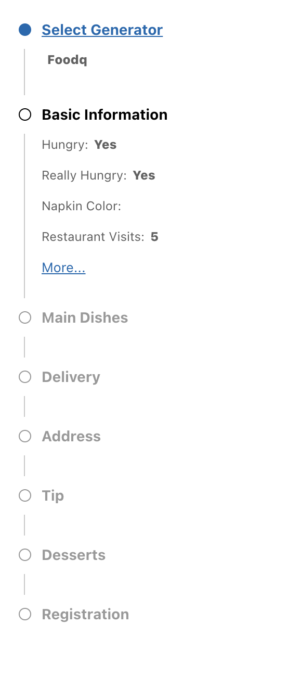
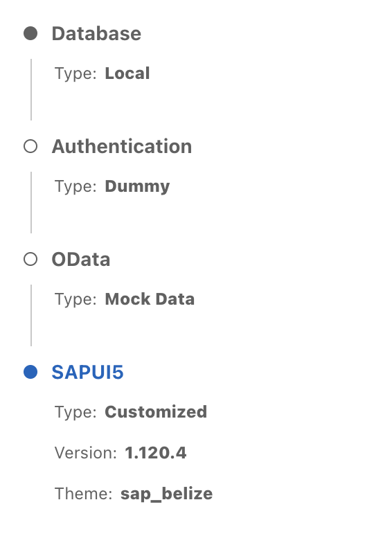
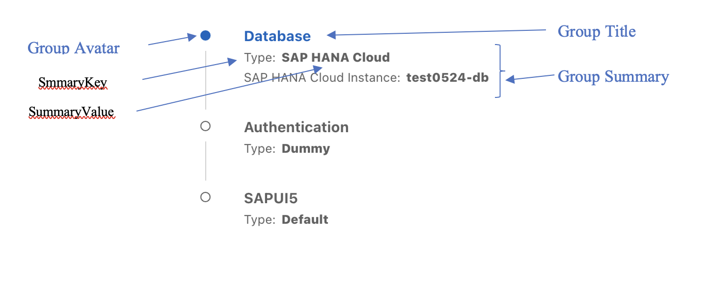
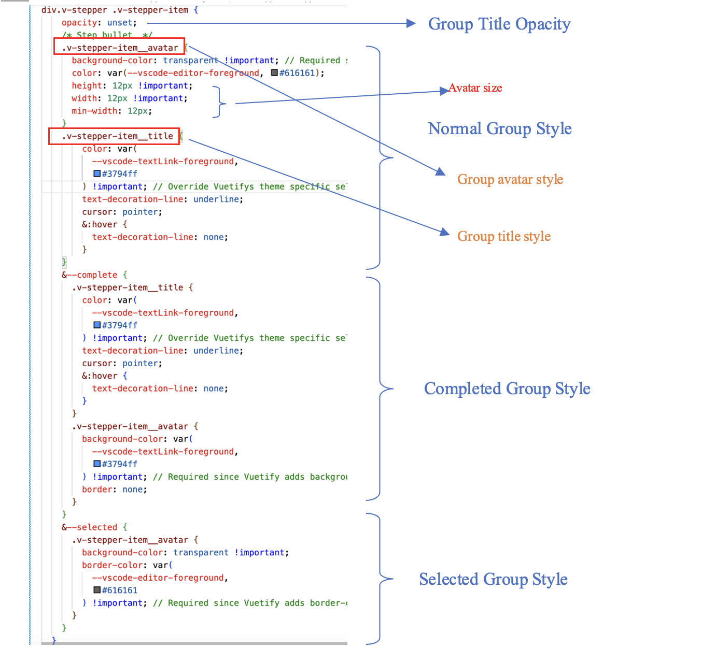
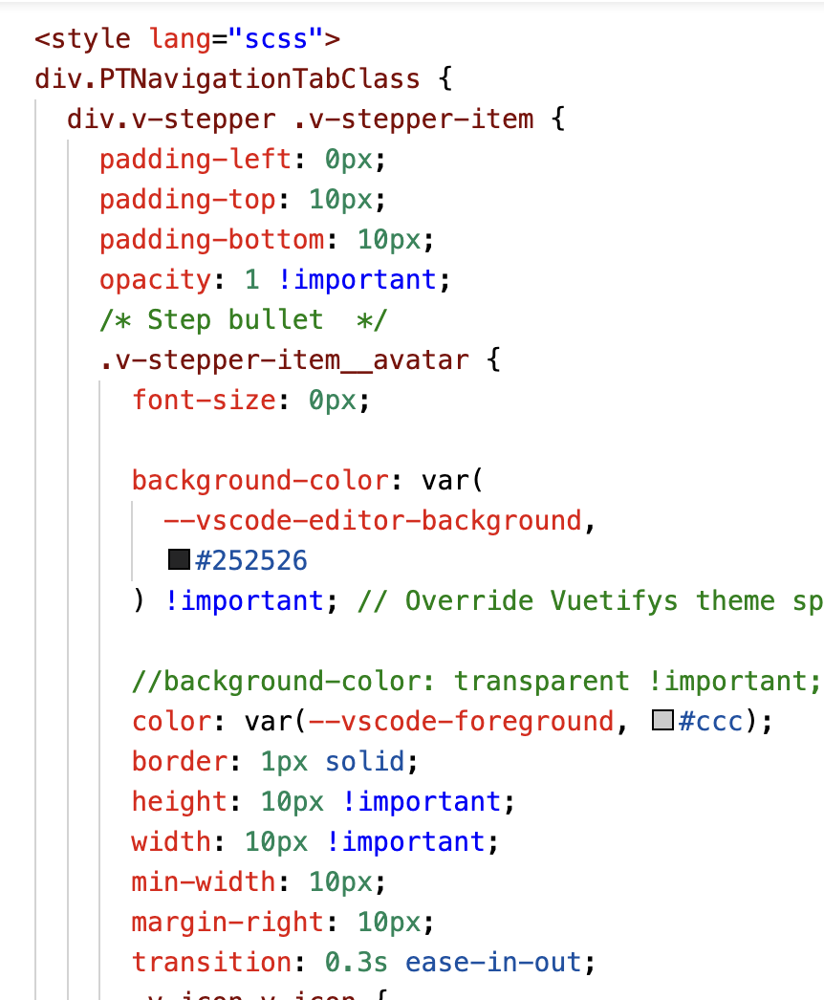
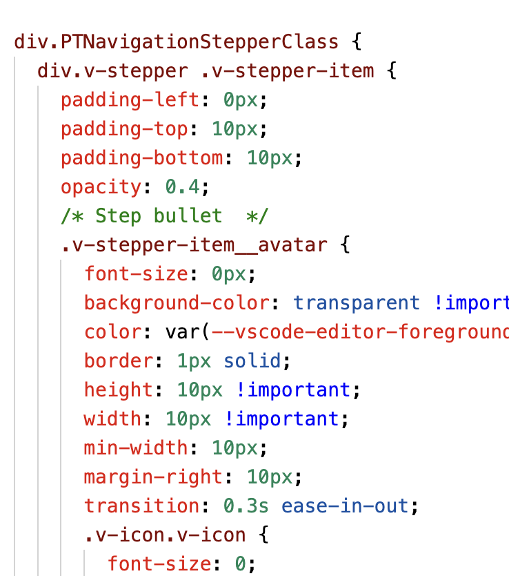
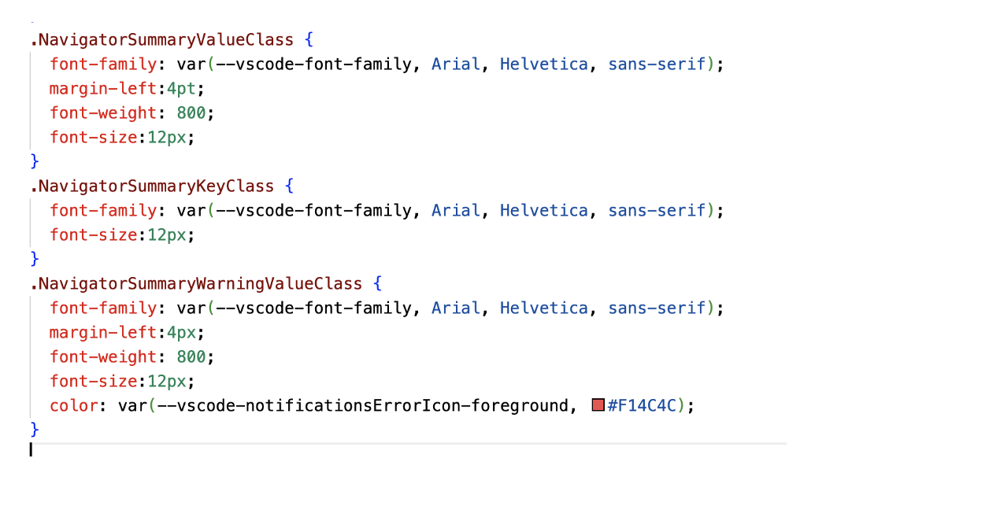

[](https://api.reuse.software/info/github.com/SAP/app-studio-toolkit)

# Navigator Control --- stepper style



# Navigator Control --- tab style



## Description

Navigator is a navigation control .
It can display the groups in a way like wizard steps or tabs control

## Anatomy



## Control Properties

- navigationType<br/>
  It can be two values:

  - “tab“ : It is a navigation control like tab control. Each group is linkable. It is default value.
  - “stepper”: it is like wizard stepper control that force a user to move linearly through your groups

- prompt-index<br/>
  It is the current group index(zero based)

- prompts<br/>
  It is the groups array, for example:

```js
  [{name:”database”},{name:”authorization”}]
```

- prompt-answers<br/>
  It is only for “stepper” navigation type. It is a group summarization, for example:

```js
  {
    promptName:”group1”,
    answers:[
            {
              "label":"prop1",
              "value":"value1",
              "type":"warning",
            },
            {
              "label":"prop1",
              "value":"value1"
            }
      ]
  }
```

- All-answers<br/>
  It is only for “tab” navigation type. It is initially all the groups summaries. For example:

```js
  {
        "group1":[
            {
              "label":"prop1",
              "value":"value1"
            },
            {
              "label":"prop1",
              "value":"value1"
            }
          ],
          "group2":[
            {
              "label":"prop1",
              "value":"value1"
            }
          ]
  }
```

- showIconForError<br/>
  If showIconForError equals true, we will use icon to represent the error type and we use the error value as the icon's tooltip. If showIconForError equals false, we display the error value with text in red.
  The default value is false.

## Control Event

- on-goto-step<br/>
  When click a group title, this event is emitted .
  - For "tab" type, the event is emitted with group index parameter(zero based).
  - For "stepper" type, the event is emitted with number of steps to go back.

### Usage

If writing a Vue application, simply add the following line to your `<template>` tag:

```html
<NavigatorControl
  :prompt-index="promptIndex"
  :prompts="prompts"
  :all-answers=" allAnswers "
  :prompt-answers="{}"
  navigation-type="tab"
  @on-goto-step="gotoStep"
  :showIconForError="true"
/>
```

The properties values looks like the following:

```js
{
  promptIndex:0,
  prompts:[{name: "group1"},{name:"group2"}],
  allAnswers:{
    group1:[
      {label:"akey1", value: "aType"},
      {label:"akey2", value: "a", type: "warning"}
    ],
    group2:[
      {label:"bkey1", value: "bType"},
      {label:"", value: "b"}
    ]
  },
  promptAnswers:{},
  navigationType:"tab"
}
```

Import the control:

```js
import NavigatorControl from "@sap-devx/controls-navigator";
const naviOptions = { vuetify };
app.use(NavigatorControl, naviOptions);
```

Import the css file:

```js
import "@sap-devx/controls-navigator/dist/navigator-control.css";
```

## Style overide

- Override “group title” and “group avatar” styles<br/>



- Override style for specific navigator type<br/>

  - For tab style<br/>
    

  - For stepper style<br/>
    

- Override “group summary” styles<br/>



## How to obtain support

Please report issues [here](https://github.com/SAP/app-studio-toolkit/issues/new/choose) and label them with `project:inquirer-gui`.

## Contributing

See [CONTRIBUTING.md](https://github.com/SAP/app-studio-toolkit/blob/main/CONTRIBUTING.md).
