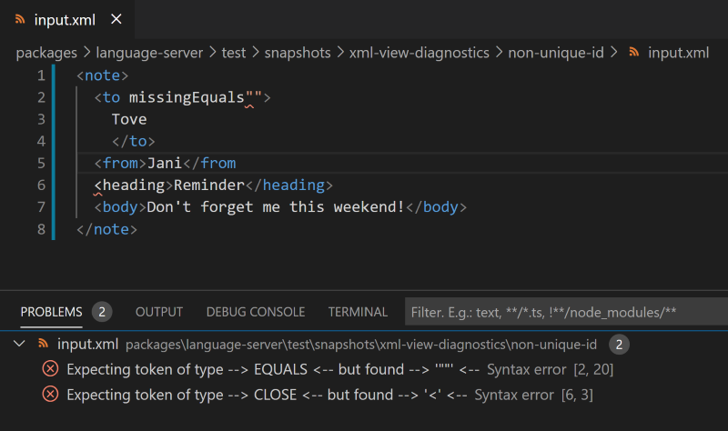

# XML Toolkit

The XML toolkit is a VSCode extension that provides XML language editor support.

## Features

### XML syntax validations

The syntax validations use a fault-tolerant parser. This enables
the detection of **multiple** syntax errors.

### XML Well-formed validations

- Unique Attribute Names.
- Tag open/close names are aligned.

#### Preview

## Installation

### From the VS Code Marketplace

In the [XML Toolkit](https://marketplace.visualstudio.com/items?itemName=SAPOSS.xml-toolkit)
page, click **Install**.

### From Github releases

1. Go to [GitHub Releases](https://github.com/SAP/app-studio-toolkit/releases).
2. Search for the `.vsix` archive under `xml-toolkit\@x.y.z` releases.
   - Replace `x.y.z` with the desired version number.
3. Follow the instructions for installing an extension from a `.vsix`
   file in the [VSCode's guide](https://code.visualstudio.com/docs/editor/extension-gallery#_install-from-a-vsix).

## Usage

The extension is activated when an `.xml` file is opened.
Both lexing and parsing errors will be shown as squiggly red underlines
and in the Problems view.

## Support

Please report issues [here](https://github.com/SAP/app-studio-toolkit/issues/new/choose) and label them with `project:xml-tools`.

## Contributing

See [CONTRIBUTING.md](https://github.com/SAP/app-studio-toolkit/blob/main/CONTRIBUTING.md).
