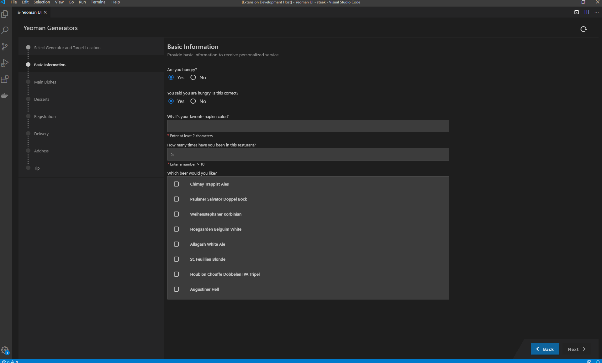

# Application Wizard

## Description

With the Application Wizard extension you can benefit from a rich user experience for yeoman generators. This extension allows developers to reuse existing yeoman generators and provide wizard-like experience with no development efforts.

This npm [mono-repo][mono-repo] currently contains:

- [VSCode Extension](./packages/backend) The backend part which communicates with Yeoman and the system. It runs as a VSCode extension or node.js application.
- [Application Wizard UI](./packages/frontend) The Application Wizard as a standalone vue.js application.
- [Yeoman generator sample](./packages/generator-foodq) Sample yeoman generator to show usages and test the platform.
- [![npm-yeoman-ui-types][npm-yeoman-ui-types-image]][npm-yeoman-ui-types-url] [@sap-devx/yeoman-ui-types](./packages/types) Type signatures supposed to be used in the yeoman generators.

[npm-yeoman-ui-types-image]: https://img.shields.io/npm/v/@sap-devx/yeoman-ui-types.svg
[npm-yeoman-ui-types-url]: https://www.npmjs.com/package/@sap-devx/yeoman-ui-types

## Support

To get more help, support, and information please open a GitHub [issue](https://github.com/SAP/app-studio-toolkit/issues/new?labels=project%3Ayeoman-ui).

## Report an Issue

See [reporting and handling issues](../../CONTRIBUTING.md#report-an-issue) in the root CONTRIBUTING.md.

## Compatibility matrix

| Generator  | yo@4.3.1 | yo@5.1.0 | yo@6.0.0 |
| ---------- | -------- | -------- | -------- |
| cjs 5.10.0 | ✅       | ✅       | ✅       |
| mjs 5.10.0 | ❌       | ✅       | ✅       |
| cjs 6.0.1  | ❌       | ❌       | ❌       |
| mjs 6.0.1  | ❌       | ✅       | ✅       |
| cjs 7.5.1  | ❌       | ❌       | ❌       |
| mjs 7.5.1  | ❌       | ❌       | ✅       |

## Debugging

The debug configurations live in [`.vscode/launch.json`](./.vscode/launch.json) and are designed to be used with the [`app-studio-toolkit.code-workspace`](../../app-studio-toolkit.code-workspace) file at the repository root. Open that workspace file in VS Code to ensure `${workspaceFolder}` resolves to this directory (`projects/yeoman-ui`) and all configurations work correctly.

### Prerequisites

Run `pnpm install` from the repository root before using any debug configuration.

### Available configurations

| Configuration                        | Description                                                                                                                                         |
| ------------------------------------ | --------------------------------------------------------------------------------------------------------------------------------------------------- |
| **Run Extension**                    | Launches the Application Wizard extension in a new VS Code Extension Development Host window. Triggers `watch backend (webpack)` pre-task.          |
| **Test Extension**                   | Runs the extension test suite inside a VS Code Extension Development Host. Triggers `watch backend (tsc)` pre-task.                                 |
| **Run YoUi websocket server**        | Starts the yeoman-ui standalone websocket server on port 8081. Use together with `pnpm serve` in `packages/frontend` for browser-based development. |
| **Run ExploreGens websocket server** | Starts the explore-generators websocket server on port 8082. Use together with `pnpm serve` in `packages/frontend`.                                 |
| **Backend unit tests**               | Runs the backend mocha test suite with the Node.js debugger attached. Requires a prior compile (`pnpm compile` in `packages/backend`).              |
| **Frontend unit tests**              | Runs the frontend Jest test suite with the Node.js debugger attached (`--inspect-brk`).                                                             |
| **Run reference generator (foodq)**  | Runs the sample `generator-foodq` via `yo` for manual testing. Requires `pnpm install` inside `packages/generator-foodq`.                           |

### Workspace tasks

The following background tasks are available in the **Terminal → Run Task** menu and are also triggered automatically as `preLaunchTask` by the configurations above:

| Task                      | Description                                                                |
| ------------------------- | -------------------------------------------------------------------------- |
| `watch backend (webpack)` | Runs webpack in development watch mode in `packages/backend`.              |
| `watch backend (tsc)`     | Runs `tsc --watch` in `packages/backend`.                                  |
| `serve frontend`          | Starts the Vite dev server in `packages/frontend` (http://localhost:5173). |
| `dev`                     | Runs `watch backend (webpack)` and `serve frontend` in parallel.           |

## Contributing

See [CONTRIBUTING.md](./CONTRIBUTING.md).

[mono-repo]: https://github.com/babel/babel/blob/master/doc/design/monorepo.md
